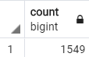

# Pewlett-Hackard-Analysis

## Overview of the analysis
Pewlett Hackard is a large company bosting several thousand employees and its been around a long time. As baby boomers begin to retire at a rapid rate, Pewlett Hackard is looking towards the future in 2 ways. First its offering retirement packages for those who meet certain criteria. Secondly, it is starting to thinking about which position will need to be filled in the near future since the number of upcoming retirements will leave thousands of openings.  Bobby is an upcoming HR analyst whose task is to perform employee research. Specifically, he needs to find answers to the following questions: Who? Who will be retiring in the next couple of years? How many? How many positions Pewlett Hackard needs to fill? Employee data Bobby needs is only available in the form of 6 CSV files. Because Pewlett Hackard is mainly using Excel and VBA to work with their data. They finally decided to update their methods and instead use SQL. The purpose of the project is to help Bobby build an employee database with SQL and import the existing data in CSV files. Also, analyze the data to generate a list of all employees eligible for retirement per title and identify employees who are eligible to participate in a mentorship program.

## Results
### The Number of Retiring Employees by Title
retirement_titles.csv file contains data for employees who will be retiring with employee titles. Based on the overview of data, there are multiple entries for employees who had moved or promoted within the company (See image below).\


unique_titles.csv file contains data for unique employees who will be retiring with their most recent employee titles. Based on the overview of data, duplicate entries for employees were removed (See image below).\


retiring_titles.csv file contains data of unique employee count per title. 29,424 employees are retiring from the Senior Engineer role and 28,254 employees are retiring from the Senior Staff role(See image below).\


### The Employees Eligible for the Mentorship Program
mentorship_eligibilty.csv file contains data for unique employees with titles who are eligible for the mentorship program (See image below).


## Summary
### How many roles will need to be filled as the "silver tsunami" begins to make an impact?
90,398 roles will need to be filled as "silver tsunami" begins to make an impact(See the query & output below).
> Query
> ``` 
> SELECT COUNT(title) count 
> INTO retiring_count
> FROM unique_titles
> ORDER BY count DESC; 
> ``` 
> Output \
> 


### Are there enough qualified, retirement-ready employees in the departments to mentor the next generation of Pewlett Hackard employees?
1,549 employees are qualified for mentorship(See the query & output below).
> Query 
> ``` 
> SELECT COUNT(title) count
> INTO mentorship_count
> FROM mentorship_eligibilty
> ORDER BY count DESC;
> ``` 
> Output \
> 

Following is the employees qualified for mentorship by titles(See the query & output below).
> Query 
> ``` 
> SELECT COUNT(title) count, 
>    title
> INTO mentorship_titles
> FROM mentorship_eligibilty
> GROUP BY title
> ORDER BY count DESC;
> ``` 
> Output \
> 

90,398 employees are retiring and 1,549 employees are qualified for mentorship. Also, Based on the comparisons of employees retiring and eligible for mentorship per title there are enough qualified retirement-ready employees in the departments to mentor the next generation of Pewlett Hackard employees(See comparison images below).

> |Retiring Titles | Mentorship Titles|
> |-----|-----|
> |||
